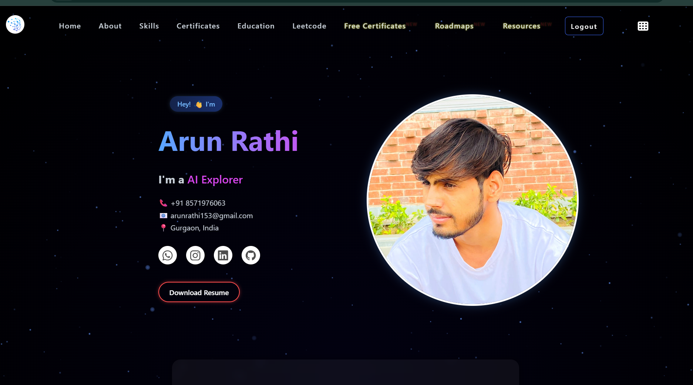

<div align="center">

# 🚀 Arun Rathi — Personal Portfolio

[](https://www.arunrathi.com)
[](https://www.linkedin.com/in/arunrathi153)
[](https://github.com/arunrathi153)

</div>

---

## 🖼️ Demo Preview

<div align="center">
  
</div>

---

Welcome to the official portfolio of **Arun Rathi** — a passionate Computer Science student (AI & ML specialization) showcasing real-world projects, competitive coding achievements, and a rich collection of learning resources.

## 🌐 Live Website

👉 **[www.arunrathi.com](https://www.arunrathi.com)**

---

## ✨ Features

| Feature | Description |
|---|---|
| 🔐 Auth | Login / Sign-up via Firebase Authentication |
| 📄 Resume | Downloadable resume (94+ ATS score) |
| 🎓 Certificates | 20+ curated free certification courses |
| 🧠 Projects | AI/ML, Web Dev, DSA projects |
| 🗺️ Roadmaps | Tech learning roadmaps |
| 📚 Resources | Curated learning resources |
| 🤖 HireWise | AI-powered resume–job matcher (sub-project) |
| 🧾 Resume Builder | Interactive resume builder tool |
| 📱 Responsive | Fully mobile-first design |
| 🎨 Animations | Scroll effects, star canvas background |

---

## 🛠️ Tech Stack

**Frontend:** HTML5, CSS3, JavaScript, Tailwind CSS  
**Backend/Auth:** Firebase (Authentication, Firestore, Realtime DB)  
**AI Integration:** Google Gemini API (via Firebase Functions)  
**Sub-project (HireWise):** Python, Flask, NLTK, scikit-learn  
**Deployment:** Firebase Hosting · Custom domain via CNAME  
**Dev Tools:** VS Code, PyCharm, Canva, Figma  

---

## 📁 Project Structure

```
portfolio-website/
├── index.html              # Landing / login page
├── dashboard.html          # Main portfolio (post-login)
├── free_certificate.html   # Free certificates page
├── roadmaps.html           # Tech roadmaps
├── resources.html          # Learning resources
├── resume-builder.html     # Resume builder tool
├── style.css               # Global styles
├── script.js               # Auth + Firebase logic
├── images/                 # All image assets
├── functions/              # Firebase Cloud Functions (Gemini AI chat)
│   ├── index.js
│   └── package.json
├── hirewise/               # HireWise AI sub-project
│   ├── app.py              # Flask application
│   ├── resume_parser.py    # Resume parsing logic
│   ├── job_matcher.py      # Job matching algorithm
│   ├── requirements.txt    # Python dependencies
│   └── templates/          # HTML templates
├── firebase.json           # Firebase hosting config
├── .gitignore
├── .env.example
└── README.md
```

---

## 🚀 Setup & Run Locally

### Portfolio (Frontend)
```bash
# Just open index.html in your browser
# Or serve with Live Server (VS Code extension)
```

### HireWise (Python Flask Sub-project)
```bash
cd hirewise/hirewise/hirewise

# Create virtual environment
python -m venv venv
venv\Scripts\activate        # Windows
# source venv/bin/activate   # Mac/Linux

# Install dependencies
pip install -r requirements.txt

# Set environment variable
set SECRET_KEY=your-secret-key

# Run
python app.py
```

### Firebase Functions (AI Chat)
```bash
cd functions
npm install
firebase deploy --only functions
```

---

## 📬 Contact

| | |
|---|---|
| 📧 Email | [arunrathi153@gmail.com](mailto:arunrathi153@gmail.com) |
| 📞 Phone | +91 8571976063 |
| 📍 Location | Gurgaon, India |
| 💼 LinkedIn | [linkedin.com/in/arunrathi153](https://www.linkedin.com/in/arunrathi153) |
| 🐙 GitHub | [github.com/arunrathi153](https://github.com/arunrathi153) |
| 📸 Instagram | [@mntl.jaat36](https://www.instagram.com/mntl.jaat36) |

---

## 📄 License

This project is for personal portfolio use. You may reference ideas or structure, but please do not copy exact content/design without permission.

---

<div align="center">
Made with 💻 and ☕ by <strong>Arun Rathi</strong>
</div>
